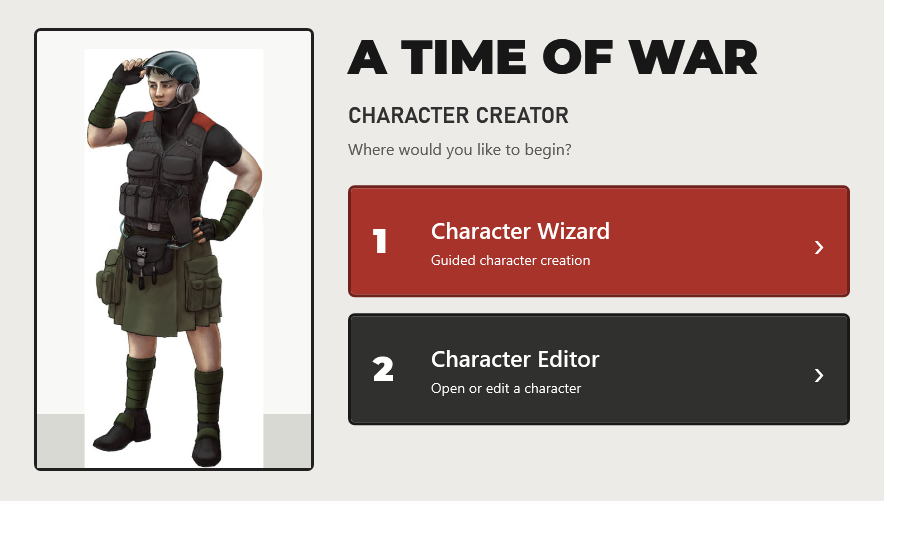
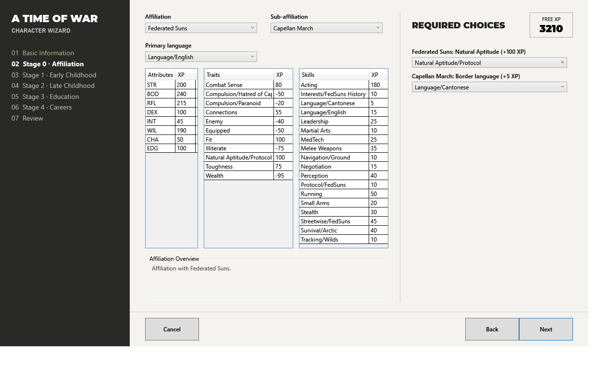
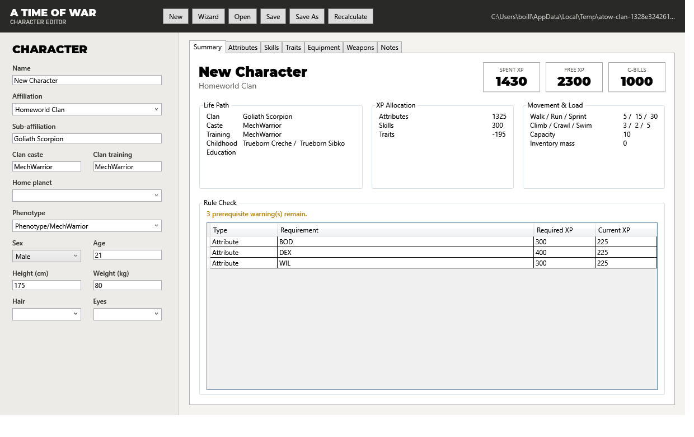

# Battletech Character Creator

## Modern .NET migration

A new WPF implementation is being developed in `src/`. It targets .NET 10 and
keeps compatibility with existing `.btcc` character files. The original Qt
application remains in the repository as a reference during migration.

This project is based on bearchik's original
[BattleTech Character Creator](https://github.com/bearchik/Battletech-Character-Creator).
The original Qt application, data, and design provide the foundation for this
modern .NET migration.

The new Create flow includes affiliations, early and late childhood, higher
education, basic, advanced, and specialist education fields, and all 46
Stage 4 real-life module variants, representing all 24 base modules in the
corrected printing. Module effects, choices, prerequisites, repeat restrictions,
and module-specific repeat penalties are implemented in the Core library.
The wizard supports two ordered careers, including legal repeat modules and
career-to-career prerequisites.
ComStar and Word of Blake characters also select a full-cost birth affiliation.
All 68 corrected Stage 0 sub-affiliation XP packages are included.
The legacy equipment, weapon, skill, trait, career, subskill, and description
catalogs are imported as structured .NET data for the editor.
Optional *A Time of War Companion* catalog entries are source-tagged and hidden
behind an explicit Companion toggle in the equipment and weapon editor tabs.
Imported Companion content currently includes vintage armor, First SLDF armor
kit entries, archaic, vintage, and advanced personal weapons, fixed-cost
advanced implants and cybernetics, extreme prosthetics, and prosthetic
enhancements, cosmetic adaptation kits, advanced combat practice equipment, and
light support vehicles that fit the current catalog model. Companion expanded
trait reference entries are also available behind the Companion toggle.

Rules are verified against *A Time of War: The BattleTech RPG, Corrected Third
Printing*. See `docs/RULES_SOURCE.md` for the authoritative page map and
migration policy. Optional material from *A Time of War Companion* is tracked in
`docs/COMPANION_AUDIT.md`. Era boundaries are imported from `Eras.xlsx`; local
Era Digest and Era Report references are tracked in `docs/ERA_SOURCE_AUDIT.md`
for era-aware defaults and campaign context. The original Qt application is an
implementation reference, not the final authority when it conflicts with the
corrected rulebook.

Build the new application with:

```powershell
dotnet build BattletechCharacterCreator.sln
dotnet run --project src/BattletechCharacterCreator.App
```

Run the dependency-free migration checks with:

```powershell
dotnet run --project tests/BattletechCharacterCreator.Tests
```

The application provides a Life Module character wizard and a detailed
character editor for *A Time of War*.

## Beta release

The current Windows beta is available from the
[GitHub Releases page](https://github.com/SANSd20/Battletech-Character-Creator/releases).
This beta is intended for manual testing and feedback while the final rulebook
audit, optional Companion coverage, and interface polish continue.

## Interface mockups

These development mockups show the current direction of the .NET interface.
Layouts and details may continue to change before the first stable release.

### Start screen



### Character wizard



### Character editor



## Development status

The .NET migration is approximately **99% complete**. The project is now in
beta testing. Automated release checks and installer smoke tests are passing;
the next gate is manual beta testing with `docs/MANUAL_TEST_PLAN.md`.

### Completed

- .NET 10 and WPF application foundation
- A Time of War app icon applied to the executable and installer
- First-launch choice window for opening the Character Wizard or Character
  Editor
- Character wizard from basic information through Stage 4
- Basic information uses campaign year, with age calculated from life-path
  choices for summaries and exports
- Campaign year infers the matching era from the imported `Eras.xlsx`
  chronology
- Era-aware affiliation and sub-affiliation availability filters with visible
  era notes for Stage 0
- Stage 0 XP accounting applies universal, affiliation, and sub-affiliation
  module costs together in spent and remaining XP totals
- Wizard stage previews show only selections picked up through the current
  stage instead of including later default selections
- Stage 1 and Stage 2 wizard choices hide Clan-only childhood modules unless
  the selected affiliation is Invading Clan or Homeworld Clan
- Era quick-start templates for common campaign eras in the editor
- All affiliations and 68 corrected sub-affiliations
- Life-path effects, prerequisites, repeat rules, and flexible XP allocation
- Stage 1 flexible XP target lists include cataloged Compulsion traits
- Stage 1 flexible XP target lists are restricted to attributes and traits
  instead of later-stage skill targets
- Fixed flexible XP choices show only the required target dropdowns and apply
  the listed XP amount without split controls
- Stage 2, Stage 3, and Stage 4 flexible XP pools start unassigned and can be split
  across added targets with per-target limits
- Stage 4 career lists hide modules whose prerequisites are not currently met
  and summarize hidden Attribute, Trait, Skill, affiliation, caste, education,
  and background requirements
- Wizard character totals remain visible while flexible XP pools still have
  unallocated or overallocated XP
- Character editor with guided Attribute, Trait, and Skill XP controls
- Searchable equipment and weapon catalogs with visible quantity-aware
  base-price totals, purchased patch and ammo totals, and unresolved-price counts
- Equipment and weapon catalog filters for faster core and Companion inventory
  selection
- Selected equipment and weapon detail panels showing source, cost, mass, and
  combat notes before adding items
- Selected equipment and weapon detail panels show campaign-year era
  availability warnings for tracked advanced or later-era items
- Inventory status warnings for over-budget, overloaded, manually priced wildcard items,
  armor patches that need patch pricing, ammo purchases that need ammo cost or
  mass details, and prosthetic enhancements that need a prosthetic or implant host
- Inventory status warnings for ammo purchases that need reload or power-pack review
- Inventory status warnings for vehicle purchases that need Vehicle or Custom Vehicle
  trait support
- Optional Companion catalog toggle with source-tagged imported equipment,
  weapons, implants, cybernetics, prosthetics, prosthetic enhancements, and
  cosmetic adaptation kits, plus advanced combat practice equipment, light
  support vehicles, and expanded trait references
- Skill and Trait editor reference panels with source labels and rule notes
- MW3-to-AToW conversion skill targets from the Companion conversion table
- Local Era Digest and Era Report source audit for era-aware behavior
- Legacy `.btcc` character save and load compatibility
- Official character-sheet PDF preview and export, including purchased patch
  and ammo inventory details
- Error report generation for unexpected UI failures and recoverable editor
  operation failures
- Error reports include app version, runtime, process, and launch diagnostics
- Release checks validate diagnostic report versions against the requested
  release version
- Release checks verify the app project version matches the requested release
  version
- Release checks verify Windows assembly/file versions match the release
  version number
- Start-window smoke runs headlessly before WPF startup so automation validates
  the launch choices without hanging on window construction
- Start-window smoke accepts installed WPF builds where the launch-screen XAML,
  image, and font are compiled resources instead of loose files
- Inventory smoke runs headlessly against catalog and inventory-rule checks so
  automation does not hang on editor window construction
- Character-sheet export smoke runs headlessly against a representative
  character so automation does not need to construct wizard/editor windows
- Windows x64 folder publish profile documented in `docs/RELEASE.md`
- Locally compile-verified per-user NSIS installer script for the .NET publish
  output
- Installer smoke-test script for install, launch diagnostics, and uninstall
  verification, including installed-app start-window validation and sheet export
- Full installer install, launch-smoke, and uninstall verification
- Automated release-check script covering tests, start window, app smokes,
  sheet export output, publish, and self-checking installer dry-run coverage
- Release checks close repo-launched app instances around app smoke, build, and
  publish steps to prevent stale file locks
- Release checks build the app once before app smoke steps and run those smokes
  without rebuilding between launches
- Wizard smoke headlessly validates era-aware wizard behavior and a representative
  character path without the slower exhaustive UI selection sweep
- Preview release packaging script with installer checksum, stale-installer
  guard, and manifest output
- Preview release package filenames include the packaged build commit
- Preview release notes included in packaged release artifacts
- GitHub-ready preview release draft included in packaged release artifacts
- GitHub release publish helper with package, checksum, manifest, and installer
  metadata/version/notes validation
- GitHub release publish helper can refresh an existing prerelease's notes and
  assets with an explicit update flag
- Manual preview test plan in `docs/MANUAL_TEST_PLAN.md` and generated manual
  test run logs under `artifacts/manual-tests`
- Automated tests covering major Inner Sphere, Periphery, ComStar, and Clan paths

### Remaining

- Run the manual preview test plan on the installed app
- Continue importing and modeling selected optional mechanics from
  *A Time of War Companion*
- Expand era template coverage after manual preview feedback
- Expand deeper reload behavior, deeper patch repair rules, ammunition modifier
  rules, and deeper vehicle purchasing details
- Continue interface polish and usability testing
- Continue strengthening error handling and recovery
- Complete the final rulebook audit
- Continue refreshing beta release notes and assets from validated preview
  packages

## License
Only for Non-commercial use.
Battletech Character Creator is free software, and is released under the terms of the Creative Commons license version 3 or (at your option) any later version. 
See https://creativecommons.org/
